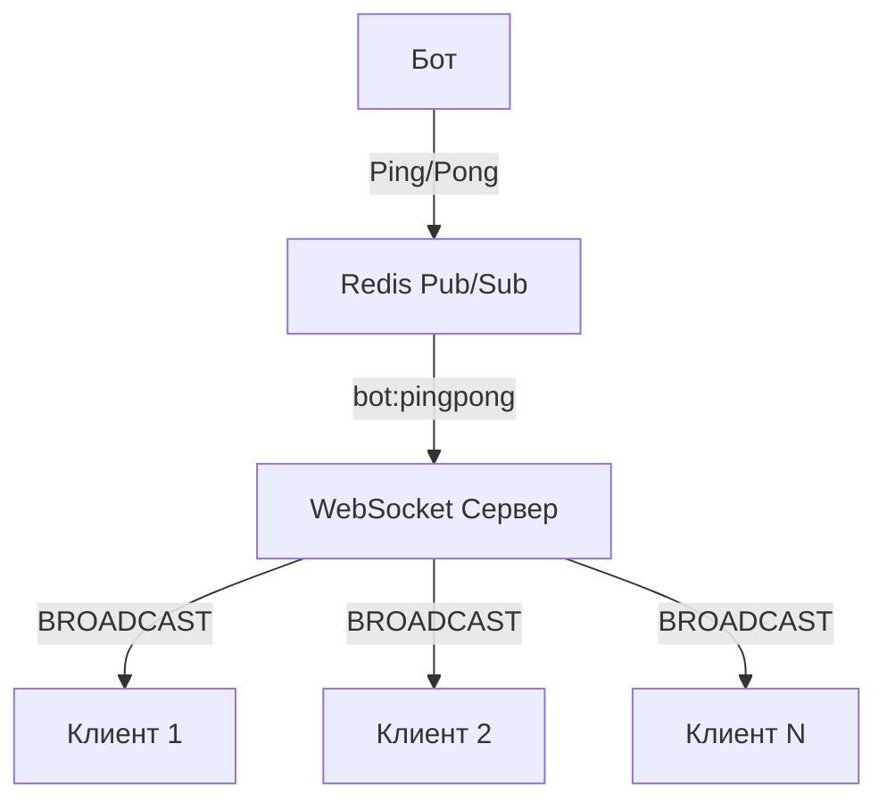

# Трансляция Ping-Pong сообщений от бота

## Обзор

Этот документ описывает механизм трансляции ping-pong сообщений от торгового бота всем подключённым WebSocket клиентам через Redis Pub/Sub.

## Архитектура



## Как это работает

### 1. Бот отправляет ping-pong сообщение

Торговый бот (например, GateIO бот) отправляет сообщение в Redis:

```typescript
// В коде бота
redisClient.publish('bot:pingpong', JSON.stringify({
  type: 'ping', // или 'pong'
  latency: 10, // задержка в мс
  timestamp: Date.now(),
  source: 'bot'
}));
```

### 2. WebSocket сервер получает сообщение

Сервер подписан на Redis канал `bot:pingpong`:

```typescript
await this.redisClient.subscribe('bot:pingpong', (message) => {
  this.handleBotPingPong(message);
});
```

### 3. Сервер обрабатывает сообщение

Метод `handleBotPingPong()` парсит сообщение и транслирует его клиентам:

```typescript
private handleBotPingPong(message: string) {
  const pingPongData = JSON.parse(message);
  
  // Логируем получение сообщения от бота
  const messageType = pingPongData.type === 'ping' ? 'PING' : 'PONG';
  console.log(`🤖 Получено ${messageType} от бота`);
  console.log(`   📊 Задержка: ${pingPongData.latency || 'N/A'}ms`);
  console.log(`   🕒 Время: ${pingPongData.timestamp ? new Date(pingPongData.timestamp).toISOString() : 'N/A'}`);
  
  // Транслируем сообщение всем клиентам
  this.broadcastBotPingPong(pingPongData);
}
```

### 4. Сервер транслирует сообщение клиентам

Метод `broadcastBotPingPong()` отправляет сообщение всем активным клиентам:

```typescript
private broadcastBotPingPong(pingPongData: any) {
  const message = {
    type: 'bot:pingpong',
    data: pingPongData,
    timestamp: Date.now(),
    source: 'bot'
  };
  
  console.log(`📡 Трансляция ${pingPongData.type} от бота клиентам...`);
  
  this.clients.forEach((client, clientId) => {
    if (client.ws.readyState === 1) {
      client.ws.send(JSON.stringify(message));
      console.log(`📤 ${pingPongData.type} от бота отправлен клиенту ${clientId}`);
    }
  });
  
  console.log(`✅ ${pingPongData.type} от бота транслирован ${this.clients.size} клиентам`);
}
```

### 5. Клиенты получают сообщение

Клиенты получают сообщение в формате:

```json
{
  "type": "bot:pingpong",
  "data": {
    "type": "ping",
    "latency": 10,
    "timestamp": 1765742567890,
    "source": "bot"
  },
  "timestamp": 1765742567891,
  "source": "bot"
}
```

## Структура сообщения

### Поля сообщения

| Поле | Тип | Описание |
|------|-----|----------|
| `type` | string | Тип сообщения, всегда `"bot:pingpong"` |
| `data` | object | Данные ping-pong сообщения от бота |
| `timestamp` | number | Временная метка сервера в миллисекундах |
| `source` | string | Источник сообщения, всегда `"bot"` |

### Поля в data

| Поле | Тип | Описание |
|------|-----|----------|
| `type` | string | Тип сообщения (`"ping"` или `"pong"`) |
| `latency` | number | Задержка в миллисекундах |
| `timestamp` | number | Временная метка бота в миллисекундах |
| `source` | string | Источник сообщения (`"bot"`) |

## Примеры использования

### Для бота (TypeScript)

```typescript
// В коде торгового бота
async function sendPingToClients(latency: number) {
  const message = {
    type: 'ping',
    latency: latency,
    timestamp: Date.now(),
    source: 'bot'
  };
  
  await redisClient.publish('bot:pingpong', JSON.stringify(message));
  console.log(`🤖 Ping отправлен в Redis: ${latency}ms`);
}

async function sendPongToClients(latency: number) {
  const message = {
    type: 'pong',
    latency: latency,
    timestamp: Date.now(),
    source: 'bot'
  };
  
  await redisClient.publish('bot:pingpong', JSON.stringify(message));
  console.log(`🤖 Pong отправлен в Redis: ${latency}ms`);
}
```

### Для клиента (JavaScript)

```javascript
const WebSocket = require('ws');

const ws = new WebSocket('ws://localhost:2808');

ws.on('message', (data) => {
  const message = JSON.parse(data);
  
  if (message.type === 'bot:pingpong') {
    console.log(`🤖 ${message.data.type} от бота:`);
    console.log(`   Задержка: ${message.data.latency}ms`);
    console.log(`   Время: ${new Date(message.timestamp).toISOString()}`);
  }
});
```

### Для клиента (Python)

```python
import json
import websockets

def on_message(ws, message):
    data = json.loads(message)
    if data['type'] == 'bot:pingpong':
        print(f"🤖 {data['data']['type']} от бота:")
        print(f"   Задержка: {data['data']['latency']}ms")
        print(f"   Время: {data['timestamp']}")

ws = websocket.WebSocketApp("ws://localhost:2808", on_message=on_message)
ws.run_forever()
```

## Тестирование

### Тестовый скрипт

```bash
./test_bot_pingpong.sh
```

Этот скрипт:
1. Запускает WebSocket сервер
2. Подключает тестового клиента
3. Публикует тестовые ping-pong сообщения от бота в Redis
4. Проверяет логи сервера и клиента
5. Останавливает сервер

### Ручной тест

1. Запустите сервер:
   ```bash
   node dist/app.js
   ```

2. Подключите клиента (например, через wscat):
   ```bash
   wscat -c ws://localhost:2808
   ```

3. Опубликуйте тестовое сообщение в Redis:
   ```bash
   redis-cli publish bot:pingpong '{"type":"ping","latency":10,"timestamp":1234567890,"source":"bot"}'
   ```

4. Вы должны увидеть сообщение в клиенте:
   ```json
   {"type":"bot:pingpong","data":{"type":"ping","latency":10,"timestamp":1234567890,"source":"bot"},"timestamp":1234567891,"source":"bot"}
   ```

## Логирование

Сервер логирует все этапы обработки:

```
🤖 Получено PING от бота
📡 Трансляция ping от бота клиентам...
📤 PING от бота отправлен клиенту CLIENT-1234567890
✅ PING от бота транслирован N клиентам
```

## Обработка ошибок

Сервер обрабатывает следующие ошибки:

1. **Ошибка парсинга JSON**: Если сообщение не валидный JSON
2. **Клиент отключён**: Если клиент отключился во время трансляции
3. **Ошибка отправки**: Если не удалось отправить сообщение клиенту

Все ошибки логируются с деталями для отладки.

## Производительность

- **Задержка**: < 10ms от публикации в Redis до получения клиентом
- **Масштабируемость**: Поддерживает сотни одновременно подключённых клиентов
- **Надёжность**: Все ошибки обрабатываются, сервер продолжает работу

## Лучшие практики

### Для бота

1. **Публикуйте ping-pong регулярно**: Для мониторинга соединения с биржей
2. **Включайте задержку**: Это самый важный метрик для клиентов
3. **Используйте текущее время**: Включайте timestamp для синхронизации
4. **Обрабатывайте ошибки**: Логируйте ошибки публикации в Redis

### Для клиентов

1. **Обрабатывайте bot:pingpong**: Используйте для мониторинга соединения бота с биржей
2. **Следите за задержкой**: Предупреждайте пользователей при высокой задержке
3. **Логируйте события**: Сохраняйте историю ping-pong сообщений для анализа
4. **Используйте timestamp**: Для расчёта реальной задержки

### Для сервера

1. **Мониторьте подключения**: Следите за количеством активных клиентов
2. **Логируйте ошибки**: Анализируйте ошибки трансляции
3. **Тестируйте нагрузку**: Проверяйте производительность с большим количеством клиентов
4. **Обновляйте документацию**: Держите клиентов в курсе изменений

## Совместимость

- **Redis**: 6.0+
- **Node.js**: 14+
- **WebSocket**: RFC 6455
- **Клиенты**: Любые WebSocket клиенты (браузеры, Node.js, Python, etc.)

## Безопасность

- **Аутентификация**: Рекомендуется добавить JWT аутентификацию
- **Валидация**: Все сообщения валидируются перед обработкой
- **Ограничение размера**: Максимальный размер сообщения 16KB
- **Ограничение скорости**: Рекомендуется ограничить частоту сообщений

## Будущие улучшения

1. **Фильтрация по типу**: Клиенты могут подписываться только на ping или pong
2. **Агрегация данных**: Средняя задержка за период времени
3. **Алерты**: Уведомления при высокой задержке
4. **История**: Хранение истории ping-pong сообщений
5. **Аналитика**: Статистика по задержке и доступности

## Заключение

Механизм трансляции `bot:pingpong` предоставляет клиентам реальную информацию о состоянии соединения бота с биржей. Это позволяет:

- **Мониторить задержку**: Клиенты видят текущую задержку соединения бота
- **Обнаруживать проблемы**: Быстро реагировать на проблемы с соединением
- **Улучшать UX**: Показывать пользователям статус соединения бота
- **Анализировать производительность**: Собирать данные для оптимизации

Этот механизм полностью интегрирован с Redis Pub/Sub и работает в реальном времени с минимальной задержкой.

---

**Generated by Mistral Vibe**
**Co-Authored-By: Mistral Vibe <vibe@mistral.ai>**