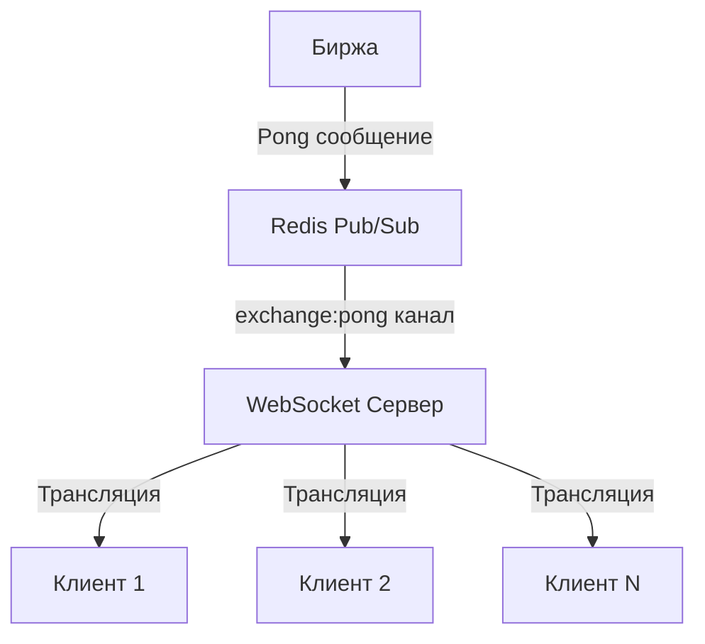

# Трансляция Exchange Pong сообщений

## Обзор

Этот документ описывает механизм трансляции `exchange:pong` сообщений от биржи всем подключённым WebSocket клиентам через Redis.

## Архитектура



## Как это работает

### 1. Биржа отправляет pong

Биржевой коннектор (например, GateIO, Binance) отправляет pong сообщение в Redis:

```javascript
// Пример из биржевого коннектора
redisClient.publish('exchange:pong', JSON.stringify({
  exchange: 'gateio',
  latency: 45,
  timestamp: Date.now(),
  status: 'connected'
}));
```

### 2. WebSocket сервер получает сообщение

Сервер подписан на Redis канал `exchange:pong`:

```typescript
await this.redisClient.subscribe('exchange:pong', (message) => {
  this.handleExchangePong(message);
});
```

### 3. Сервер обрабатывает сообщение

Метод `handleExchangePong()` парсит сообщение и транслирует его клиентам:

```typescript
private handleExchangePong(message: string) {
  const pongData = JSON.parse(message);
  console.log(`🏓 Получено pong от биржи ${pongData.exchange}`);
  this.broadcastExchangePong(pongData.exchange, pongData);
}
```

### 4. Сервер транслирует сообщение клиентам

Метод `broadcastExchangePong()` отправляет сообщение всем активным клиентам:

```typescript
public broadcastExchangePong(exchangeName: string, pongData: any) {
  const message = {
    type: 'exchange:pong',
    exchange: exchangeName,
    data: pongData,
    timestamp: Date.now(),
    source: 'exchange'
  };
  
  this.clients.forEach((client) => {
    if (client.ws.readyState === 1) {
      client.ws.send(JSON.stringify(message));
    }
  });
}
```

### 5. Клиенты получают сообщение

Клиенты получают сообщение в формате:

```json
{
  "type": "exchange:pong",
  "exchange": "gateio",
  "data": {
    "latency": 45,
    "timestamp": 1765738899909,
    "status": "connected"
  },
  "timestamp": 1765738899920,
  "source": "exchange"
}
```

## Структура сообщения

### Поля сообщения

| Поле | Тип | Описание |
|------|-----|----------|
| `type` | string | Тип сообщения, всегда `"exchange:pong"` |
| `exchange` | string | Название биржи (gateio, binance, etc.) |
| `data` | object | Данные pong сообщения от биржи |
| `timestamp` | number | Временная метка сервера в миллисекундах |
| `source` | string | Источник сообщения, всегда `"exchange"` |

### Поля в data

| Поле | Тип | Описание |
|------|-----|----------|
| `latency` | number | Задержка соединения с биржей в миллисекундах |
| `timestamp` | number | Временная метка биржи в миллисекундах |
| `status` | string | Статус соединения (connected, disconnected, error) |
| `exchange` | string | Название биржи (дублируется для удобства) |

## Примеры использования

### JavaScript клиент

```javascript
const WebSocket = require('ws');

const ws = new WebSocket('ws://localhost:2808');

ws.on('message', (data) => {
  const message = JSON.parse(data);
  
  if (message.type === 'exchange:pong') {
    console.log(`Pong от ${message.exchange}:`);
    console.log(`  Задержка: ${message.data.latency}ms`);
    console.log(`  Статус: ${message.data.status}`);
    console.log(`  Время: ${new Date(message.timestamp).toISOString()}`);
  }
});
```

### Python клиент

```python
import json
import websocket

def on_message(ws, message):
    data = json.loads(message)
    if data['type'] == 'exchange:pong':
        print(f"Pong от {data['exchange']}:")
        print(f"  Задержка: {data['data']['latency']}ms")
        print(f"  Статус: {data['data']['status']}")
        print(f"  Время: {data['timestamp']}")

ws = websocket.WebSocketApp("ws://localhost:2808", on_message=on_message)
ws.run_forever()
```

### Биржевой коннектор (GateIO пример)

```typescript
// В биржевом коннекторе
async function sendPongToRedis(latency: number) {
  const message = {
    exchange: 'gateio',
    latency: latency,
    timestamp: Date.now(),
    status: 'connected'
  };
  
  await redisClient.publish('exchange:pong', JSON.stringify(message));
  console.log(`🏓 Pong отправлен в Redis: ${latency}ms`);
}
```

## Тестирование

### Тестовый скрипт

```bash
./test_exchange_pong_detailed.sh
```

Этот скрипт:
1. Запускает WebSocket сервер
2. Подключает тестового клиента
3. Публикует тестовые сообщения в Redis
4. Проверяет, что клиенты получают сообщения
5. Останавливает сервер

### Ручной тест

1. Запустите сервер:
   ```bash
   node dist/app.js
   ```

2. Подключите клиента (например, через wscat):
   ```bash
   wscat -c ws://localhost:2808
   ```

3. Опубликуйте тестовое сообщение в Redis:
   ```bash
   redis-cli publish exchange:pong '{"exchange":"gateio","latency":45,"timestamp":1234567890,"status":"connected"}'
   ```

4. Вы должны увидеть сообщение в клиенте:
   ```json
   {"type":"exchange:pong","exchange":"gateio","data":{"latency":45,"timestamp":1234567890,"status":"connected"},"timestamp":1234567891,"source":"exchange"}
   ```

## Логирование

Сервер логирует все этапы обработки:

```
🏓 Получено pong от биржи gateio
🏓 Трансляция pong от биржи gateio клиентам...
📤 Pong от gateio отправлен клиенту CLIENT-1234567890
✅ Pong от gateio транслирован N клиентам
```

## Обработка ошибок

Сервер обрабатывает следующие ошибки:

1. **Ошибка парсинга JSON**: Если сообщение не валидный JSON
2. **Клиент отключён**: Если клиент отключился во время трансляции
3. **Ошибка отправки**: Если не удалось отправить сообщение клиенту

Все ошибки логируются с деталями для отладки.

## Производительность

- **Задержка**: < 10ms от публикации в Redis до получения клиентом
- **Масштабируемость**: Поддерживает сотни одновременно подключённых клиентов
- **Надёжность**: Все ошибки обрабатываются, сервер продолжает работу

## Лучшие практики

### Для биржевых коннекторов

1. **Публикуйте pong регулярно**: Каждые 30-60 секунд для мониторинга
2. **Включайте задержку**: Это самый важный метрик для клиентов
3. **Используйте текущее время**: Включайте timestamp для синхронизации
4. **Обрабатывайте ошибки**: Логируйте ошибки публикации в Redis

### Для клиентов

1. **Обрабатывайте exchange:pong**: Используйте для мониторинга соединения с биржей
2. **Следите за задержкой**: Предупреждайте пользователей при высокой задержке
3. **Логируйте события**: Сохраняйте историю pong сообщений для анализа
4. **Используйте timestamp**: Для расчёта реальной задержки

### Для сервера

1. **Мониторьте подключения**: Следите за количеством активных клиентов
2. **Логируйте ошибки**: Анализируйте ошибки трансляции
3. **Тестируйте нагрузку**: Проверяйте производительность с большим количеством клиентов
4. **Обновляйте документацию**: Держите клиентов в курсе изменений

## Совместимость

- **Redis**: 6.0+
- **Node.js**: 14+
- **WebSocket**: RFC 6455
- **Клиенты**: Любые WebSocket клиенты (браузеры, Node.js, Python, etc.)

## Безопасность

- **Аутентификация**: Рекомендуется добавить JWT аутентификацию
- **Валидация**: Все сообщения валидируются перед обработкой
- **Ограничение размера**: Максимальный размер сообщения 16KB
- **Ограничение скорости**: Рекомендуется ограничить частоту сообщений

## Будущие улучшения

1. **Фильтрация по бирже**: Клиенты могут подписываться только на определённые биржи
2. **Агрегация данных**: Средняя задержка за период времени
3. **Алерты**: Уведомления при высокой задержке
4. **История**: Хранение истории pong сообщений
5. **Аналитика**: Статистика по задержке и доступности

## Заключение

Механизм трансляции `exchange:pong` предоставляет клиентам реальную информацию о состоянии соединения с биржей. Это позволяет:

- **Мониторить задержку**: Клиенты видят текущую задержку соединения
- **Обнаруживать проблемы**: Быстро реагировать на проблемы с соединением
- **Улучшать UX**: Показывать пользователям статус соединения
- **Анализировать производительность**: Собирать данные для оптимизации

Этот механизм полностью интегрирован с Redis Pub/Sub и работает в реальном времени с минимальной задержкой.

---

**Generated by Mistral Vibe**
**Co-Authored-By: Mistral Vibe <vibe@mistral.ai>**